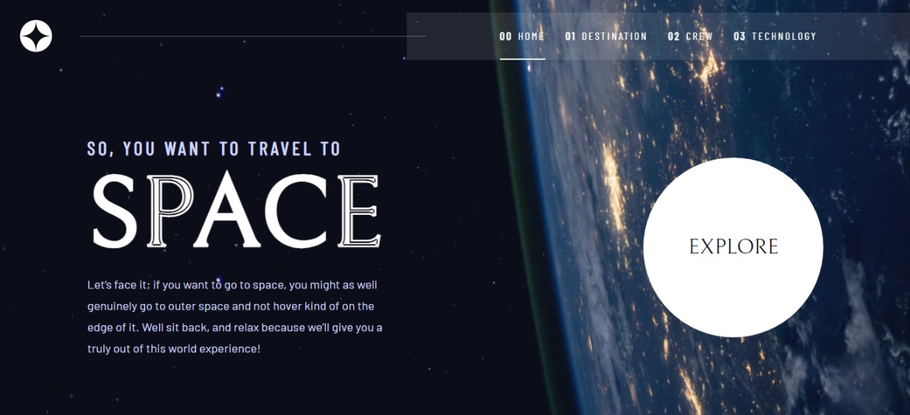

# Frontend Mentor - Space tourism website solution

This is a solution to the [Space tourism website challenge on Frontend Mentor](https://www.frontendmentor.io/challenges/space-tourism-multipage-website-gRWj1URZ3). Frontend Mentor challenges help you improve your coding skills by building realistic projects.

## Table of contents

- [Overview](#overview)
  - [The challenge](#the-challenge)
  - [Screenshot](#screenshot)
  - [Links](#links)
- [My process](#my-process)
  - [Built with](#built-with)
  - [What I learned](#what-i-learned)
- [Author](#author)

## Overview

### The challenge

Users should be able to:

- View the optimal layout for each of the website's pages depending on their device's screen size
- See hover states for all interactive elements on the page
- View each page and be able to toggle between the tabs to see new information

### Screenshot



### Links

- Solution URL: [View Solution](https://www.frontendmentor.io/solutions/space-tourism-site-reactjs-8wRh46j1yC)
- Live Site URL: [View Demo](https://space-tourism-site-self.vercel.app/)

## My process

### Built with

- Semantic HTML5 markup
- CSS custom properties
- Flexbox
- Mobile-first workflow
- [React](https://reactjs.org/) - JS library

### What I learned

I learned how to use react router for navigation.

To see how you can add code snippets, see below:

```jsx
<main className="app">
  <Routes>
    <Route path="/" element={<Home />} />
    <Route path="/destination" element={<DestinationPage />} />
    <Route path="/crew" element={<CrewPage />} />
    <Route path="/technology" element={<TechnologyPage />} />
  </Routes>
</main>
```

## Author

- Website - [Adetoye](https://adetoye.vercel.app)
- Frontend Mentor - [@adetoye-dev](https://www.frontendmentor.io/profile/adetoye-dev)
- Twitter - [@adetoye_dev](https://www.twitter.com/adetoye_dev)
